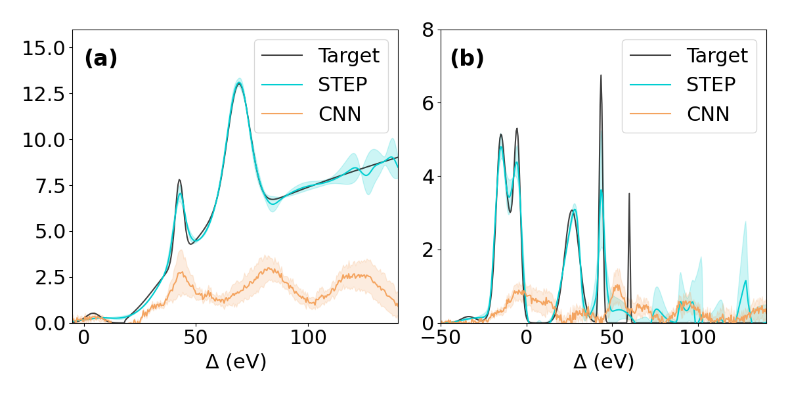
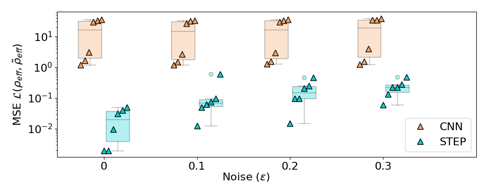

# STEP: Interpretable Extraction of underlying Physics with robust Machine Learning
This repository is the official implementation of "STEP: Interpretable Extraction of underlying Physics with robust Machine Learning". 


## Requirements

This project relies on `python` with versions `>= 3.10, <3.12`.

To install requirements:

```setup
pip install -r requirements.txt
```

## Training

To train the models in the paper, run the following commands.

### For STEP:

```train
python -m step train data/testing
```

Note that STEP is trained on individual DoS, so it is directly applied to the testing set.

### For End-to-End:

```train
python -m end_to_end train data/training
```

The default hyperparameters are generally well set. However, if you wish to override any, you can
do so using CLI options. Simply run any command with `--help` to see a list of available options.

Note that most code will write logs to the `runs` directory.
## Testing

To run tests on step and end-to-end models respectively, run e.g. the following commands:

```test
python -m step test models/noise10/neural_dos_0.pt data/testing/density_of_states/dos_0.pkl
```

```test
python -m end_to_end test models/noise10/end_to_end.pt data/testing
```

## Pre-trained Models

Pre-trained models are included in the `models` folder.

## Results

To generate the figures seen in the main text, use:

```plot
python -m plot figure-5
```



```plot
python -m plot figure-6
```



## Contributing

This code is subject to the MIT license, read [the license](./LICENSE) for details.
